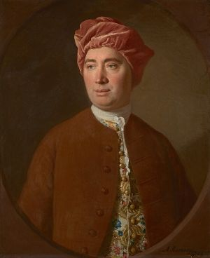

# David Hume
  
*David Hume (7 May 1711 – 25 August 1776), painting*

**Life Span:** 1711–1776

**School:** British Empiricism, Scottish Enlightenment

## Key Ideas
- **[Problem of Induction](../arguments/problem-of-induction.md)**: No rational justification for inferring future from past experience
- **Causation as Habit**: Causal connections are mental habits, not objective necessities
- **Is-Ought Problem**: Cannot derive normative conclusions from purely descriptive premises
- **Critique of Miracles**: Extraordinary claims require extraordinary evidence
- **Bundle Theory of Self**: No substantial self, only bundle of perceptions
- **Moral Sentimentalism**: Morality based on feelings rather than reason

## Major Works
- *A Treatise of Human Nature* (1739-40)
- *An Enquiry Concerning Human Understanding* (1748)
- *An Enquiry Concerning the Principles of Morals* (1751)
- *Dialogues Concerning Natural Religion* (1779, posthumous)

## Philosophical Position
Hume applied empirical methodology consistently, arguing that all knowledge comes from experience. This led him to skeptical conclusions about causation, [induction](../concepts/epistemology/induction.md), personal identity, and religious belief. He distinguished between "relations of ideas" (logic, mathematics) and "matters of fact" (empirical claims), arguing that the latter cannot achieve [certainty](../concepts/epistemology/certainty.md).

## Epistemological Contributions

### Fork of Knowledge
- **Relations of Ideas**: Knowable by reason alone (mathematics, logic)
  - Certain but tell us nothing about world
  - True by definition or logical necessity
- **Matters of Fact**: Known through experience
  - Informative about world but uncertain
  - Always logically possible to deny

### Copy Principle
- **All ideas derive from impressions** (sensory experiences)
- **No innate ideas**: Mind begins as blank slate
- **Test for meaningfulness**: Ideas without corresponding impressions are meaningless
- **Critique of metaphysics**: Many traditional concepts fail this test

### Skeptical Arguments

#### Problem of Induction
1. **All empirical reasoning** depends on assumption that future will resemble past
2. **This assumption cannot be proven** deductively or inductively without circularity
3. **Therefore, inductive reasoning** has no rational foundation
4. **Yet we cannot help but reason inductively**: Custom and habit guide belief

#### Critique of Causation
- **Never observe "necessary connections"** between events
- **Only observe constant conjunction**: A-type events followed by B-type events
- **Causal necessity** is projection of mental habit onto external world
- **Causation as regularity**: Constant conjunction plus psychological expectation

#### Problem of External World
- **Direct awareness only of perceptions**, not external objects
- **Cannot prove external world exists** beyond our ideas
- **Mitigated skepticism**: Practical belief despite theoretical doubt
- **Natural belief**: Cannot help believing in external objects

## Moral Philosophy

### Sentiment vs Reason
- **Reason is slave of passions**: Cannot motivate action by itself
- **Moral judgments express feelings**: Approval/disapproval toward actions
- **No objective moral facts**: Values not discoverable by reason alone
- **Sympathy as foundation**: Extended through imagination and communication

### Is-Ought Problem
- **Descriptive premises** cannot entail normative conclusions
- **Naturalistic fallacy**: Moving from "is" to "ought" without justification
- **Critique of rational morality**: Reason alone cannot establish moral duties
- **Influential problem**: Central to modern metaethics

## Philosophy of Religion

### Critique of Natural Theology
- **Design Argument Critique**: Analogy between world and human artifacts weak
- **Problem of Evil**: Suffering incompatible with perfect designer
- **Anthropomorphism**: Projecting human qualities onto deity
- **Religious Skepticism**: Insufficient evidence for religious beliefs

### Miracles Argument
1. **Miracle violates natural law** by definition
2. **Natural laws established by uniform experience**
3. **Testimony for miracle** must outweigh evidence for natural law
4. **This practically never happens**: More likely that testimony is false

## Personal Identity

### Bundle Theory
- **No substantial self** persisting through time
- **Self is bundle of perceptions** held together by memory and association
- **No deeper unity**: Just stream of conscious experiences
- **Anticipates**: Modern cognitive science and Buddhist philosophy

### Critique of Rational Soul
- **No impression of self**: Introspection reveals only particular perceptions
- **Memory creates appearance** of continuous identity
- **Personal identity as fiction**: Useful construction, not metaphysical fact

## Influences
**Influenced by:** Locke, Berkeley, Newton, ancient skeptics (Sextus Empiricus)  
**Influenced:** Kant ("awakened from dogmatic slumber"), Mill, Russell, logical positivism, contemporary skepticism

## Related Concepts
- [Induction](../concepts/epistemology/induction.md)
- [Skepticism](../concepts/epistemology/skepticism.md)
- [Causation](../concepts/metaphysics/causation.md)
- [Knowledge](../concepts/epistemology/knowledge.md)
- [Belief](../concepts/epistemology/belief.md)
- [Perception](../concepts/epistemology/perception.md)
- [Justification](../concepts/epistemology/justification.md)

## Key Arguments
- [Problem of Induction](../arguments/problem-of-induction.md)
- [Critique of Causation](../arguments/hume-causation.md)
- [Miracles Argument](../arguments/hume-miracles.md) ⚠️ Placeholder
- [Is-Ought Problem](../arguments/is-ought-problem.md)

## Historical Context
Writing during the Enlightenment, Hume applied scientific method to human nature itself. His skeptical conclusions challenged both religious orthodoxy and rationalist philosophy, helping establish empiricism as major philosophical tradition.

## Contemporary Relevance
- **Philosophy of Science**: Problems of confirmation, explanation, natural laws
- **Epistemology**: Foundationalism vs coherentism, problem of skepticism
- **Metaethics**: Expressivism, error theory, moral psychology
- **Cognitive Science**: Studies of causal reasoning, moral judgment

## Responses to Hume

### Kantian Response
- **Synthetic a priori knowledge**: Necessary truths about experience
- **Transcendental arguments**: Conditions for possibility of experience
- **Categories of understanding**: Mind structures experience according to concepts

### Pragmatist Response
- **Practical consequences**: Beliefs justified by success in action
- **Fallibilism**: Knowledge possible without certainty
- **Naturalized epistemology**: Empirical study of knowledge acquisition

## Significance for A Fortiori
Hume exemplifies rigorous application of empirical standards that reveals limitations of human [knowledge](../concepts/epistemology/knowledge.md). His skeptical arguments provide essential challenges to philosophical overconfidence.

## Key Questions
- Can Hume's skeptical arguments be answered or must they be accepted?
- Is the problem of induction genuinely unsolvable?
- How should we respond to the gap between reason and passion in morality?
- What are the practical implications of Humean skepticism?

## Sources
- Hume, David. *An Enquiry Concerning Human Understanding*
- Stroud, Barry. *Hume*
- Norton, David Fate. *The Cambridge Companion to Hume*
- Millican, Peter. *Reading Hume on Human Understanding*

**Tags:** `#hume` `#empiricism` `#induction` `#skepticism` `#causation` `#is-ought` `#miracles`  
**Last Updated:** 2025-09-18  
