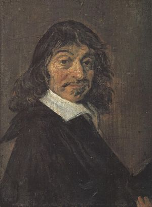

# René Descartes
  
*René Descartes (31 March 1596 – 11 February 1650), portrait*

**Life Span:** 1596–1650

**School:** Rationalism, Modern Philosophy

## Key Ideas
- **Cogito Ergo Sum**: "I think, therefore I am" - the one indubitable truth surviving systematic doubt
- **[Methodological Doubt](../concepts/meta-philosophy/methodological-doubt.md)**: Systematic questioning of all beliefs to find certain foundations
- **Substance Dualism**: Mind and body are distinct substances (res cogitans vs res extensa)
- **Clear and Distinct Ideas**: Criterion for truth based on rational intuition
- **Mechanical Philosophy**: Physical world operates according to mathematical laws
- **God as Guarantor**: Divine perfection ensures reliability of clear and distinct perceptions

## Major Works
- *Discourse on Method* (1637)
- *Meditations on First Philosophy* (1641)
- *Principles of Philosophy* (1644)
- *The Passions of the Soul* (1649)

## Philosophical Position
Descartes sought to establish philosophy on absolutely certain foundations using mathematical methods. He believed reason could discover indubitable truths about reality, beginning with the thinking self and proceeding to prove God's existence and the external world. His rationalist approach emphasized innate ideas and deductive reasoning over empirical observation.

## The Cartesian Method
### Four Rules (Discourse on Method)
1. **Never accept anything as true** unless clearly and evidently so
2. **Divide complex problems** into simple parts
3. **Order thoughts from simple to complex**
4. **Review thoroughly** to ensure nothing is omitted

### Stages of Doubt
1. **Sensory Deception**: Senses sometimes mislead us
2. **Dreaming Argument**: Cannot distinguish dreams from waking experience  
3. **Evil Demon Hypothesis**: Systematic deception about all experience
4. **Mathematical Truths**: Even logic and math might be unreliable

### The Cogito Discovery
- **Self-refuting to doubt thinking**: The act of doubting proves thinking exists
- **Thinking requires a thinker**: Cannot have thoughts without a thinking substance
- **Immediate self-knowledge**: Direct awareness of mental states
- **Foundation for knowledge**: Building block for further certain truths

## Influences
**Influenced by:** Scholastic philosophy, Augustine, mathematical method (Euclid)  
**Influenced:** Spinoza, Leibniz, Malebranche, modern epistemology, rationalist tradition

## Related Concepts
- [Methodological Doubt](../concepts/meta-philosophy/methodological-doubt.md)
- [Certainty](../concepts/epistemology/certainty.md)
- [Foundation](../concepts/meta-philosophy/foundation.md)
- [Skepticism](../concepts/epistemology/skepticism.md)
- [First Principles](../concepts/meta-philosophy/first-principles.md)
- [Knowledge](../concepts/epistemology/knowledge.md)

## Key Arguments
- [Cogito Argument](../arguments/descartes-dreaming-argument.md): Self-evident existence of thinking self
- [Ontological Argument](../arguments/descartes-ontological-argument.md) ⚠️ Placeholder: God's existence from concept of perfection
- [Causal Argument for God](../arguments/descartes-causal-argument.md) ⚠️ Placeholder: Idea of infinite being requires infinite cause
- [Argument for External World](../arguments/descartes-external-world.md): God's trustworthiness guarantees material world

## Historical Context
Writing during the Scientific Revolution, Descartes sought to provide philosophical foundations for the new mathematical physics. His work bridged medieval Scholasticism and modern philosophy, introducing systematic doubt while maintaining belief in God and immortal soul.

## Contemporary Relevance
- **Epistemology**: Foundationalism vs coherentism debates
- **Philosophy of Mind**: Mind-body problem, consciousness studies
- **Skepticism**: Response to skeptical scenarios (brain in vat, simulation hypothesis)
- **Method**: Role of doubt and systematic inquiry in philosophy and science

## Criticisms
- **Circle Objection**: Uses God to validate clear and distinct ideas, then proves God through clear and distinct ideas
- **Other Minds Problem**: How can we know other thinking substances exist?
- **Interaction Problem**: How can immaterial mind affect material body?
- **Empiricist Critique**: Overemphasizes reason at expense of experience

## Significance for A Fortiori
Descartes exemplifies the search for absolutely certain [foundations](../concepts/meta-philosophy/foundation.md). His systematic doubt provides a model for rigorous philosophical analysis, while his rationalist confidence contrasts with the agnostic caution.

## Key Questions
- Can systematic doubt really be carried out consistently?
- Is the cogito genuinely indubitable or does it assume too much?
- What is the relationship between methodological and metaphysical doubt?
- How should we evaluate the cogito's contemporary relevance?

## Sources
- Descartes, René. *Meditations on First Philosophy*
- Williams, Bernard. *Descartes: The Project of Pure Enquiry*
- Cottingham, John. *Descartes*
- Wilson, Margaret. *Descartes*

**Tags:** `#descartes` `#cogito` `#rationalism` `#methodological-doubt` `#dualism` `#certainty` `#foundations`  
**Last Updated:** 2025-09-18  
