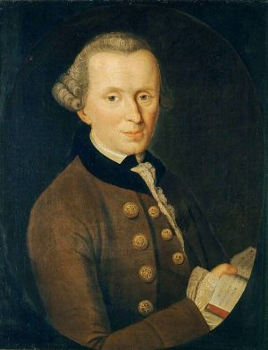

# Immanuel Kant
  
*Immanuel Kant (22 April 1724 – 12 February 1804), portrait*

**Life Span:** 1724–1804

**School:** German Idealism, Transcendental Philosophy

## Key Ideas
- **Transcendental Idealism**: We know phenomena (appearances) but not noumena (things-in-themselves)
- **Synthetic A Priori Knowledge**: Necessary truths about experience that are not merely definitional
- **Categories of Understanding**: Mind structures experience according to fundamental concepts
- **[Transcendental Arguments](../arguments/transcendental-arguments.md)**: Reasoning from conditions of possibility
- **Categorical Imperative**: Moral law based on universalizability and treating persons as ends
- **Limits of Reason**: Theoretical reason cannot prove God, freedom, or immortality

## Major Works
- *Critique of Pure Reason* (1781/1787)
- *Critique of Practical Reason* (1788)
- *Critique of Judgment* (1790)
- *Groundwork for the Metaphysics of Morals* (1785)
- *Religion Within the Boundaries of Mere Reason* (1793)

## Philosophical Position
Kant sought to navigate between empiricist skepticism and rationalist dogmatism by arguing that while all knowledge begins with experience, not all knowledge derives from experience. The mind actively structures experience through a priori concepts and intuitions, making synthetic a priori knowledge possible while limiting reason's scope.

## Transcendental Philosophy

### Copernican Revolution
- **Objects conform to knowledge** rather than knowledge conforming to objects
- **Mind actively structures experience** rather than passively receiving impressions
- **Conditions of possibility**: What makes experience possible also limits what we can know
- **Phenomena vs noumena**: Appearances vs things as they are independent of experience

### Synthetic A Priori
- **Synthetic**: Informative about world (not merely definitional)
- **A Priori**: Knowable independently of particular experience
- **Examples**: Mathematics, pure physics, metaphysical principles
- **Possibility**: Mind's necessary structuring of all possible experience

### Transcendental Deduction
**Central argument of first *Critique***:
1. **Self-consciousness requires** unified experience
2. **Unified experience requires** synthesis according to concepts
3. **These concepts (categories)** apply necessarily to all objects of experience
4. **Therefore**: Categories have objective validity within experience

## Categories of Understanding

### Quantity
- Unity, Plurality, Totality

### Quality  
- Reality, Negation, Limitation

### Relation
- Inherence-Subsistence, Causality-Dependence, Community

### Modality
- Possibility-Impossibility, Existence-Non-existence, Necessity-Contingency

## Response to Hume

### Problem of Causation
- **Hume**: No rational basis for causal necessity
- **Kant**: Causation is a priori category, necessarily applies to all experience
- **Transcendental argument**: Causal connections required for unified temporal experience
- **Limitation**: Only applies to phenomena, not things-in-themselves

### Problem of Induction
- **Hume**: No justification for uniformity of nature
- **Kant**: Uniformity follows from mind's necessary structuring of experience
- **Scientific knowledge**: Possible within bounds of possible experience
- **Metaphysical knowledge**: Impossible beyond those bounds

## Moral Philosophy

### Categorical Imperative
**First Formulation (Universal Law)**: Act only according to maxims you could will to be universal laws

**Second Formulation (Humanity)**: Act so as to treat humanity, whether in your own person or that of another, always as an end and never merely as a means

**Third Formulation (Kingdom of Ends)**: Act as if you were legislating for a kingdom where all rational beings are both subjects and sovereigns

### Good Will
- **Only unconditionally good thing**: Good will (intention to do duty)
- **Consequences irrelevant**: Moral worth depends on motivation, not results
- **Duty vs inclination**: Acting from duty has moral worth; acting from inclination doesn't
- **Autonomy**: Rational beings self-legislate moral law

### Freedom and Determinism
- **Practical freedom**: Ability to act according to self-imposed rational principles
- **Transcendental freedom**: Independence from empirical determination
- **Compatibility**: Natural causation in phenomenal realm, freedom in noumenal realm
- **Moral responsibility**: Requires transcendental freedom

## Philosophy of Religion

### Moral Argument for God
1. **Moral obligation** requires highest good (virtue proportioned to happiness)
2. **Highest good** requires God to coordinate virtue and happiness
3. **We are morally obligated**
4. **Therefore**: We must postulate God's existence for practical purposes

### Postulates of Practical Reason
- **God**: Guarantees connection between virtue and happiness
- **Freedom**: Required for moral responsibility
- **Immortality**: Provides infinite time for moral perfection
- **Practical faith**: Rational belief for moral purposes without theoretical proof

### Limits of Natural Theology
- **Theoretical proofs fail**: Ontological, cosmological, teleological arguments invalid
- **Transcendental illusion**: Reason naturally seeks unconditioned
- **Practical necessity**: Religious belief justified practically, not theoretically
- **Rational [faith](../concepts/philosophy-religion/faith.md)**: Belief based on moral needs

## Aesthetic Theory

### Judgment of Taste
- **Disinterested**: Not based on desire or purpose
- **Universal**: Claims agreement from all rational beings
- **Purposiveness without purpose**: Object seems designed but for no determinate end
- **Necessary**: Not arbitrary preference but grounded judgment

### Sublime
- **Mathematical sublime**: Overwhelming magnitude
- **Dynamic sublime**: Overwhelming power
- **Supersensible destination**: Reveals our rational nature transcending sensible limitations

## Political Philosophy

### Republicanism
- **Separation of powers**: Legislative, executive, judicial
- **Representative government**: Indirect democracy
- **Rule of law**: Universal legal principles
- **Civil constitution**: Guarantees individual rights

### Perpetual Peace
- **Republican constitution** in all states
- **Federation of free states**: International law without world government
- **Universal hospitality**: Right of cosmopolitan citizenship
- **Philosophical history**: Progress toward enlightenment and peace

## Influences
**Influenced by:** Hume (awakened from "dogmatic slumber"), Rousseau (moral feeling), Newton (scientific method), Wolff (systematic philosophy)  
**Influenced:** German Idealism (Fichte, Schelling, Hegel), phenomenology, analytic philosophy, contemporary ethics

## Related Concepts
- [Transcendental Arguments](../arguments/transcendental-arguments.md)
- [Knowledge](../concepts/epistemology/knowledge.md)
- [Certainty](../concepts/epistemology/certainty.md)
- [Objectivity](../concepts/epistemology/objectivity.md)
- [Foundation](../concepts/meta-philosophy/foundation.md)
- [Skepticism](../concepts/epistemology/skepticism.md)

## Key Arguments
- [Transcendental Deduction](../arguments/transcendental-deduction.md) ⚠️ Placeholder
- [Transcendental Arguments](../arguments/transcendental-arguments.md)
- [Antinomies of Pure Reason](../arguments/kant-antinomies.md) ⚠️ Placeholder
- [Moral Argument for God](../arguments/kant-moral-argument.md) ⚠️ Placeholder
- [Categorical Imperative](../arguments/categorical-imperative.md)

## Historical Context
Writing during the Enlightenment, Kant sought to preserve both scientific knowledge and moral responsibility against Humean skepticism and materialist determinism. His "critical philosophy" aimed to establish secure foundations for knowledge while limiting reason's pretensions.

## Contemporary Relevance
- **Epistemology**: Conceptual schemes, theory-ladenness of observation
- **Ethics**: Deontological ethics, respect for persons, autonomy
- **Political Philosophy**: Democratic theory, international relations, human rights
- **Philosophy of Science**: Role of a priori principles in scientific knowledge

## Major Interpretations
- **Idealist reading**: Mind constitutes empirical reality
- **Realist reading**: Mind structures access to independent reality  
- **Two-aspect theory**: Same reality appears differently from different standpoints
- **Pragmatist reading**: Focus on conditions for successful practice

## Significance for A Fortiori
Kant's critical philosophy exemplifies systematic analysis of reason's scope and limits. His [transcendental arguments](../arguments/transcendental-arguments.md) provide a method for establishing necessary conditions while avoiding dogmatic claims about ultimate reality.

## Key Questions
- Can synthetic a priori knowledge really exist?
- Are Kant's transcendental arguments compelling?
- How should we understand the relationship between phenomena and noumena?
- Does Kantian ethics provide adequate guidance for concrete moral decisions?

## Sources
- Kant, Immanuel. *Critique of Pure Reason*
- Guyer, Paul. *Kant and the Claims of Knowledge*
- Allison, Henry. *Kant's Transcendental Idealism*
- Wood, Allen. *Kant's Ethical Thought*

**Tags:** `#kant` `#transcendental` `#synthetic-a-priori` `#categorical-imperative` `#idealism` `#critical-philosophy`  
**Last Updated:** 2025-09-18  
