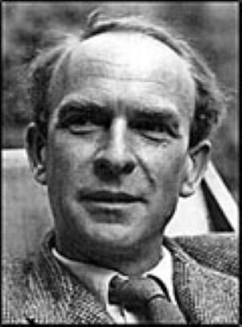

# P.F. Strawson

*P.F. Strawson (23 November 1919 – 13 February 2006)*

**Life Span:** 1919–2006

**School:** Ordinary Language Philosophy, Analytic Philosophy

## Key Ideas

- **Descriptive Metaphysics**: Analysis of actual conceptual schemes rather than revisionary proposals
- **Persons as Primitives**: Personal identity doesn't reduce to physical or mental criteria
- **Presupposition vs Implication**: Failure of presupposition creates truth-value gaps
- **[Transcendental Arguments](../arguments/transcendental-arguments.md)**: Modern revival of Kantian method
- **Reactive Attitudes**: Moral responsibility based on emotions like resentment and gratitude
- **Critique of Formal Logic**: Natural language reasoning differs from formal systems

## Major Works

- *Introduction to Logical Theory* (1952)
- *Individuals: An Essay in Descriptive Metaphysics* (1959)
- *The Bounds of Sense* (1966) - major study of Kant
- *Freedom and Resentment* (1974)
- *Skepticism and Naturalism* (1985)

## Philosophical Position

Strawson practiced "descriptive metaphysics"—analyzing our actual conceptual framework rather than proposing revisions. He argued that ordinary language embeds sophisticated philosophical insights that formal systems often miss or distort. His work bridges [logic](../concepts/logic/logic.md), metaphysics, and moral philosophy through careful attention to linguistic practice.

## Contributions to Logic

### Critique of Russell's Theory of Descriptions

- **Russell**: "The King of France is bald" is false (no King of France)
- **Strawson**: Statement neither true nor false—presupposition fails
- **Presupposition vs assertion**: Different logical relationships
- **Truth-value gaps**: Some statements lack truth values when presuppositions fail

### Presupposition Theory

- **Existential presuppositions**: Definite descriptions presuppose existence
- **Semantic vs pragmatic**: Presupposition as semantic phenomenon
- **Failure consequences**: Neither assertion nor denial appropriate
- **Natural language logic**: Formal logic misses important distinctions

### Ordinary Language vs Formal Logic

- **Context dependence**: Natural language meaning varies by context
- **Pragmatic factors**: Speaker intentions affect logical relationships
- **Use vs mention**: Different functions of language in reasoning
- **Formalization limits**: Formal systems miss crucial features of reasoning

## Descriptive Metaphysics

### Basic Particulars

- **Material bodies**: Fundamental category in our conceptual scheme
- **Spatial-temporal framework**: Basic structure for identifying particulars
- **Persons**: Irreducible category, not analyzable into mind plus body
- **Conceptual priority**: Some concepts more fundamental than others

### Personal Identity

- **Persons as primitives**: Cannot reduce persons to physical or mental components
- **P-predicates**: Predicates applicable to persons (both mental and physical)
- **Self-ascription**: Special authority in attributing mental states to oneself
- **Other-ascription**: Different criteria for attributing mental states to others

### Individual Reference

- **Identification**: How we pick out particular objects in discourse
- **Demonstrative reference**: "This," "that" as basic referring expressions
- **Spatiotemporal location**: Primary method for identifying material objects
- **Proper names**: Connection between names and descriptive identification

## Transcendental Arguments

### Revival of Kantian Method

- **Conditions of possibility**: What must be true for experience to be possible?
- **Anti-skeptical use**: Showing skeptical scenarios undermine themselves
- **Conceptual necessity**: Not psychological or causal necessity
- **Objective world**: Argument that experience requires external objects

### Argument Against Skepticism

1. **Self-consciousness** requires ability to distinguish self from not-self
2. **This distinction** requires experience of external objects
3. **Skeptical doubt** about external world undermines conditions for doubt itself
4. **Therefore**: External world skepticism is self-refuting

### Bounds of Sense (Kant Critique)

- **Transcendental deduction**: Successful argument for objectivity of experience
- **Transcendental idealism**: Problematic distinction between phenomena and noumena
- **Constructive critique**: Keep transcendental arguments, abandon idealism
- **Analytic Kantianism**: Kantian insights without metaphysical commitments

## Moral Philosophy

### Reactive Attitudes

- **Participant stance**: Engaged emotional responses to others' actions
- **Objective stance**: Detached, causal understanding of behavior
- **Moral responsibility**: Based on appropriateness of reactive attitudes
- **Natural phenomenon**: Responsibility practices rooted in human nature

### Freedom and Determinism

- **Strawsonian compatibilism**: Determinism compatible with moral responsibility
- **Conditions for responsibility**: Quality of will, not ultimate origination
- **Manipulation cases**: Responsibility undermined by certain causal histories
- **Participant reactive attitudes**: Resentment, gratitude, indignation as central

### Moral Psychology

- **Emotions in ethics**: Moral judgments connected to emotional responses
- **Social practices**: Moral responsibility as social institution
- **Naturalistic approach**: Moral concepts grounded in human psychology
- **Anti-metaphysical**: No deep metaphysical facts about free will needed

## Philosophy of Mind

### Mental State Attribution

- **Asymmetry thesis**: Different criteria for self- and other-attribution
- **First-person authority**: Special status of self-knowledge
- **Behavioral criteria**: Basis for attributing mental states to others
- **Conceptual connections**: Logical relationships between mental concepts

### Mind-Body Problem

- **Persons as primitives**: Reject Cartesian dualism and materialism
- **Conceptual analysis**: Dissolve traditional problems through linguistic analysis
- **Ordinary concepts**: Start with actual practices of mental state attribution
- **Anti-reductionism**: Mental concepts irreducible to physical or behavioral

## Critique of Philosophical Method

### Revisionary vs Descriptive Metaphysics

- **Descriptive**: Analyze actual conceptual frameworks
- **Revisionary**: Propose better conceptual schemes (Russell, Quine)
- **Conservative approach**: Respect ordinary conceptual practices
- **Therapeutic philosophy**: Dissolve problems rather than solve them

### Limits of Formalization

- **Context sensitivity**: Natural language meaning varies by situation
- **Pragmatic factors**: Speaker intentions and conversational implicature
- **Holistic understanding**: Concepts understood within entire frameworks
- **Formalization distortion**: Formal systems miss crucial features

## Influences

**Influenced by:** Kant, Wittgenstein, Austin, ordinary language philosophy
**Influenced:** Contemporary metaphysics, philosophy of mind, moral psychology, neo-Kantian philosophy

## Related Concepts

- [Transcendental Arguments](../arguments/transcendental-arguments.md)
- [Logic](../concepts/logic/logic.md)
- [Truth](../concepts/epistemology/truth.md)
- [Knowledge](../concepts/epistemology/knowledge.md)
- [Objectivity](../concepts/epistemology/objectivity.md)
- [Foundation](../concepts/meta-philosophy/foundation.md)

## Key Arguments

- [Transcendental Arguments](../arguments/transcendental-arguments.md)
- [Argument Against Skepticism](../arguments/strawson-anti-skeptical.md) ⚠️ Placeholder
- [Persons as Primitives](../arguments/strawson-persons.md) ⚠️ Placeholder
- [Reactive Attitudes Theory](../arguments/reactive-attitudes.md) ⚠️ Placeholder

## Historical Context

Writing in post-war Oxford, Strawson developed ordinary language philosophy's insights into systematic philosophical positions. His work represents mature development of Wittgensteinian themes about language and conceptual analysis.

## Contemporary Relevance

- **Metaphysics**: Neo-Aristotelian approaches, grounding theory
- **Philosophy of Mind**: Anti-reductionism about persons and mental states
- **Ethics**: Strawsonian compatibilism, moral responsibility theory
- **Epistemology**: Transcendental arguments, anti-skeptical strategies

## Major Debates

### Presupposition vs Implication

- **Strawsonian presupposition**: Existential commitments of definite descriptions
- **Russellian analysis**: Descriptions analyzed as quantified statements
- **Truth-value gaps**: Whether statements can lack truth values
- **Formal vs natural**: Relationship between logic and ordinary language

### More

- **Effectiveness**: Do they really refute skepticism?
- **Modality**: What kind of necessity do they establish?
- **Scope**: How general are transcendental conclusions?
- **Kantian interpretation**: Relationship to original Kantian project

## Significance for A Fortiori

Strawson's [transcendental arguments](../arguments/transcendental-arguments.md) provide a method for establishing necessary conditions of thought and experience without dogmatic metaphysical commitments. His descriptive approach aligns with careful analysis of concepts and arguments in philosophical inquiry.

## Key Questions

- Are transcendental arguments genuinely anti-skeptical?
- Can descriptive metaphysics avoid revisionary implications?
- What is the relationship between ordinary language and philosophical truth?
- How do reactive attitudes ground moral responsibility?

## Sources

- Strawson, P.F. *Individuals: An Essay in Descriptive Metaphysics*
- Strawson, P.F. *The Bounds of Sense*
- Hacker, P.M.S. *Insight and Illusion: Themes in the Philosophy of Wittgenstein*
- Stern, Robert. *Transcendental Arguments and Scepticism*

**Tags:** `#strawson` `#descriptive-metaphysics` `#transcendental-arguments` `#presupposition` `#persons` `#reactive-attitudes`

**Last Updated:** 2025-09-18
